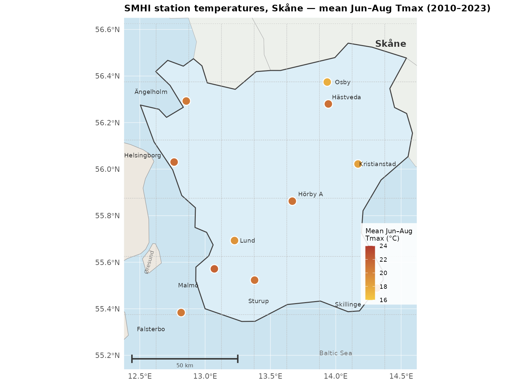
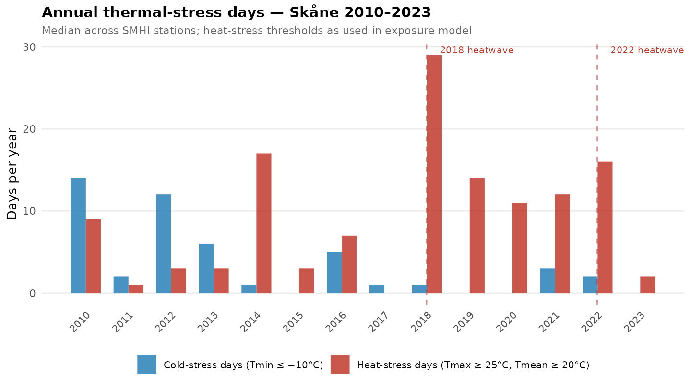

# Data infrastructure for *In Search of Lost Time*
### Supporting the Formas Explore 2025 application (PI: Gefenaite, Lunds universitet)

---

## Proposal overview

**In Search of Lost Time: How Living Environments Shape Health and Mortality in Older People in Times of Crisis** is a 48-month Formas Explore project (Sep 2026 – Aug 2030, ~6 MSEK) investigating how indoor and outdoor living environments affect health and mortality in older adults during multi-hazard events. The project uses the **Register RELOC-AGE** — a nationally representative longitudinal dataset linking health, sociodemographic characteristics, and residential environment for >4 million Swedes born 1932–68.

The primary hazards are:
- **2018 and 2022 heatwaves** and their related events (drought, wildfires)
- **COVID-19 pandemic** 2020–2023

The four objectives are:

| # | Label | Core question |
|---|-------|---------------|
| O1 | **Impact** | How do indoor and outdoor living environments affect health and mortality during (multi-)hazards? |
| O2 | **Resilience** | How do individual and neighbourhood characteristics explain why some older adults fare better than others? |
| O3 | **Sustainable environments** | Which living environment features aid recovery after health setbacks during and after hazards? |
| O4 | **Human rights** | How do international human rights standards frame adequate protection for older adults against foreseeable hazards? |

This repository covers the **data management and novel data acquisition** component of the project (Christie, 10% FTE).

---

## Data linkage strategy

RELOC-AGE links individuals to their residential property via the **Real Estate Property Register (REPR)**. Every individual in the cohort has a geocoded residential address at each point in time. This means that any spatially-resolved dataset — temperature grids, air quality fields, fire detections, neighbourhood polygons, energy certificates — can be linked to individuals by **coordinate and date**, without requiring a separate identifier.

The principle applied throughout this work:

> *If a dataset can be resolved to a location and a time, it can be joined to RELOC-AGE participants.*

The exposure matrix produced here provides one row per date × building type, ready for linkage to health outcomes by residential address.

---

## How data sources map to project objectives

| Data source | Spatial grain | Temporal grain | Primary objective(s) |
|-------------|--------------|----------------|----------------------|
| SMHI station obs. | ~12 stations, Skåne | Daily | O1 — hazard definition |
| ERA5 reanalysis | 0.25° grid (~25 km) | Hourly → daily | O1 — gridded exposure |
| RC thermal model (BETSI + Fraunhofer) | Building era × day | Daily | O1 — indoor exposure |
| Boverket EPC | Individual building | Static (decl. year) | O1, O3 — building quality |
| Copernicus CAMS air quality | 0.1° grid (~10 km) | Daily | O1 — related hazard (fire smoke) |
| NASA FIRMS wildfire detections | ~375 m pixels | Daily | O1 — related hazard (wildfires) |
| SCB DeSO neighbourhood stats | ~800-resident areas | Annual (2018) | O2 — neighbourhood resilience |
| COVID-19 data (on secure server) | Municipality / region | Weekly / daily | O1 — COVID pandemic arm |

---

## Study area

Skåne (Scania), Sweden's southernmost region (~11,000 km²), serves as the primary study area. It is the third-most populous region in Sweden (~1.4 million residents), contains the city of Malmö and substantial agricultural land, and was among the most severely affected Swedish regions during both the 2018 and 2022 heatwaves.



*Figure 1. Skåne (light blue) within southern Sweden, showing the 12 active SMHI weather stations coloured by mean June–August daily maximum temperature (2010–2023; yellow = cooler, dark red = warmer; scale 16–24 °C). Faint dashed grey lines mark the ERA5 0.25° reanalysis grid cells (~25 × 25 km), which provide complete spatial temperature coverage; each RELOC-AGE residential address is assigned to the cell it falls in. Coastal western sites (Malmö, Helsingborg, Falsterbo) are 1–2 °C warmer in summer than inland stations, reflecting urban heat and proximity to Øresund.*



*Figure 2. Annual count of heat-stress days (Tmax ≥ 25°C and Tmean ≥ 20°C for ≥ 3 consecutive days) and cold-stress days (Tmin ≤ −10°C for ≥ 3 consecutive days), median across SMHI stations. The 2018 heatwave (18 event days) is the most extreme in the record; 2022 produced two shorter episodes. These are the two primary hazard events targeted in objectives O1–O3.*

---

## Data sources

### Hazard characterization (→ O1)

#### SMHI station observations ✓ complete
- **What**: Daily Tmean/Tmax/Tmin, humidity, and precipitation from 12–39 active stations in Skåne
- **Coverage**: 2010-01-01 to 2023-12-31
- **Output**: `01_smhi/output/smhi_*_daily.rds`; extreme event flags in `extreme_events.rds`
- **Role in proposal**: Defines the timing and intensity of the 2018 and 2022 heatwave events used as exposure in O1. Also identifies cold snaps and heavy rain co-exposures relevant to multi-hazard framing.
- **Events identified**: 15 heat waves, 4 cold snaps, 14 heavy precipitation events
  - 2018 heatwave: 15-day event Jul 21 – Aug 4 (longest on record in this period)
  - 2022: two episodes, Jul 19–21 and Aug 12–18

#### ERA5 reanalysis ⏳ downloading
- **What**: ERA5 is the fifth-generation ECMWF atmospheric reanalysis, combining a global weather model with historical observations using data assimilation to produce physically consistent gridded climate fields (Hersbach et al., 2020). It provides hourly estimates of atmospheric, land, and oceanic variables at 0.25° × 0.25° resolution (~25 km grid) back to 1940.
- **Variables extracted**: 2 m air temperature (Tmean, Tmax, Tmin), 2 m dewpoint, 10 m wind components
- **Coverage**: 2010–2023, downloaded as 168 monthly NetCDF files (~429 KB each) via the Copernicus Climate Data Store
- **Output**: `05_era5/output/era5_skane_YYYY_MM.nc` → `era5_skane_daily.rds`
- **Role in proposal**: ERA5 provides complete spatial coverage of Skåne — 54 grid cells covering the region — compared to just 12 active SMHI ground stations. This means every RELOC-AGE residential address can be assigned a temperature record by spatial lookup into the ERA5 grid, rather than relying on the nearest (potentially distant) ground station. ERA5 also provides wind speed and humidity needed to compute heat index and apparent temperature, which are more physiologically relevant exposure measures than air temperature alone.

> Hersbach, H., Bell, B., Berrisford, P., et al. (2020). The ERA5 global reanalysis. *Quarterly Journal of the Royal Meteorological Society*, 146(730), 1999–2049. https://doi.org/10.1002/qj.3803

#### Influenza surveillance ✓ complete
- **What**: Weekly influenza incidence from Folkhälsomyndigheten
- **Source**: `data/binflReg_*.xlsx` (regional 2015 w40–2026 w11)
- **Output**: `01_smhi/output/influenza_weekly.csv` (year, week, incidence_per_100k for Skåne)
- **Role in proposal**: Potential co-hazard marker for the multi-hazard framing; winter influenza weeks can be identified for concurrent cold snap + infection analyses. Skåne max = 30.6/100k; the current epidemic threshold (>50/100k) flags no weeks — threshold may need adjustment for regional analysis.

---

### Indoor exposure model (→ O1)

A central methodological contribution of this project is estimating the **indoor temperature** that older adults actually experienced, rather than using outdoor temperature as a proxy. Outdoor and indoor temperatures decouple substantially during heat events, and the magnitude of this decoupling depends on building insulation quality.

#### RC thermal model approach

A first-order resistor-capacitor (RC) model treats the building as a thermal circuit: the wall acts as a resistor (R, thermal resistance) and the building's thermal mass as a capacitor (C, heat storage capacity). The model describes how indoor temperature T_in evolves in response to outdoor temperature T_out (Bacher & Madsen, 2011):

```
dT_in/dt = (T_out − T_in) / τ,   where τ = R × C  (hours)
```

The time constant τ summarises the whole-building thermal response. A small τ means a thin, leaky envelope where indoor temperature tracks outdoor conditions closely — dangerous during heatwaves. A large τ means a well-insulated, thermally massive building where indoor temperature is buffered from outdoor extremes. τ is estimated empirically from the Fraunhofer indoor/outdoor time series and scaled to each building insulation era using factors derived from the BETSI national survey.

> Bacher, P. & Madsen, H. (2011). Identifying suitable models for the heat dynamics of buildings. *Energy and Buildings*, 43(7), 1511–1522. https://doi.org/10.1016/j.enbuild.2011.02.005

#### BETSI building survey ✓ complete
- **What**: National survey of Swedish residential buildings (~2009): construction year, type, floor area, ventilation, thermal envelope indicators
- **Output**: `02_betsi/output/betsi_buildings.rds`, `betsi_thermal_params.rds`
- **Role in proposal**: Provides the insulation-era stratification (pre-1961 through post-2005) that determines τ, and therefore the indoor temperature trajectory during a heatwave for each era class. RELOC-AGE participants are assigned an era based on their building's construction year via REPR.

#### Fraunhofer OpenSmartHomeData ✓ complete
- **What**: High-frequency indoor + outdoor temperature, single residential building (Germany, 2017)
- **Output**: `03_fraunhofer/output/rc_model_params.rds`
- **Role in proposal**: Provides empirical validation of RC model mechanics. τ converges to upper bound (72 h) in the spring dataset; BETSI-derived τ values used in preference for the final exposure model.

#### Building insulation epochs

| Epoch | Build years | Key feature | Thermal vulnerability | τ (h) |
|-------|-------------|-------------|----------------------|--------|
| pre_1961 | –1960 | Stone/brick, variable insulation | 0.82 | 5.5 |
| 1961_1975 | 1961–1975 | Miljonprogrammet: thin concrete, minimal insulation | **0.90** | 3.5 |
| 1976_1985 | 1976–1985 | Post-BBR75 reforms | 0.55 | 7.0 |
| 1986_1995 | 1986–1995 | Improved standards | 0.40 | 9.0 |
| 1996_2005 | 1996–2005 | Modern insulation | 0.30 | 12.0 |

The 1961–1975 Miljonprogrammet era is the most thermally vulnerable. Many of these buildings house older adults in Skåne's suburbs, making the era × heat interaction a key hypothesis for O1.

#### Boverket Energy Performance Certificates ⏳ awaiting API key
- **What**: Certified energy performance data for individual buildings: energy class (A–G), primary energy use (kWh/m²/year), heating system type, construction year, fastighetsbeteckning (property ID)
- **API**: `https://api.boverket.se/energideklarationer` — subscription key applied for, expected within a few days
- **Output**: `10_epc/output/epc_skane.rds`
- **Role in proposal**:
  1. *O1* — provides empirically measured energy use per building, enabling direct linkage from REPR (fastighetsbeteckning) to actual building performance, rather than relying on era-averaged BETSI estimates. Buildings with poor energy class (E–G) within the same construction era will show greater indoor heat accumulation.
  2. *O3* — energy class is a candidate "sustainable environment" characteristic: do older adults in energy-efficient buildings (A–C) recover more quickly from health setbacks following heatwaves?

---

### Related events: wildfires and air quality (→ O1)

The proposal explicitly identifies drought and **wildfires** as hazards related to the 2018 and 2022 heatwaves. Sweden's summer 2018 wildfire season was the worst on record and coincided with the peak heatwave period. This creates a compound exposure (heat + smoke) that has not been quantified at the individual level for RELOC-AGE participants.

#### NASA FIRMS wildfire detections ⏳ needs MAP_KEY
- **What**: VIIRS S-NPP daily active fire detections at ~375 m resolution, with fire radiative power (FRP) and confidence classification
- **API**: `https://firms.modaps.eosdis.nasa.gov/api/country/csv/{KEY}/VIIRS_SNPP_SP/SWE/{YEAR}` — free key required (instant, register at firms.modaps.eosdis.nasa.gov/api)
- **Coverage**: Sweden 2012–2023
- **Output**: `07_firms/output/firms_skane.rds` (point detections), `firms_events.rds` (daily fire flag + mean FRP)
- **Role in proposal**: Creates a daily binary fire-activity flag and FRP intensity measure for Skåne. These are linked to RELOC-AGE participants by date. Allows O1 analyses to separate pure heat exposure from heat+wildfire compound events — directly relevant to the multi-hazard framing cited in the application (Ducros et al., 2024).

#### Copernicus CAMS air quality reanalysis ✓ script ready
- **What**: European air quality reanalysis at ~0.1° (~10 km) resolution; PM2.5, PM10, O3, NO2
- **Credentials**: `~/.adsapirc` in place
- **Coverage**: Sweden 2013–2022
- **Output**: `08_cams/output/cams_skane_daily.rds`
- **Role in proposal**: Wildfire smoke drives elevated PM2.5. During July–August 2018, smoke from Swedish fires was measurable across Skåne even without local ignitions. CAMS provides the daily pollution exposure that mediates between fire activity and respiratory/cardiovascular health outcomes in O1. CAMS data also characterises air quality during COVID-19 lockdown periods (traffic-related NO2 reduction), relevant for the pandemic arm of the study.

---

### Neighbourhood resilience factors (→ O2)

O2 investigates how **neighbourhood-level characteristics** moderate the relationship between living environment and health outcomes, with specific focus on deprivation and ethnicity. DeSO (Demografiska statistikområden) is the SCB statistical geography at the residential neighbourhood scale (~800 residents per area).

#### SCB DeSO neighbourhood statistics ✓ script ready
- **What**: SCB PxWeb API data for all Skåne DeSO areas; no key required
  - Foreign-born share (proxy for ethnic composition of neighbourhood, relevant to O2 ethnicity focus)
  - Age 65+ share (characterises neighbourhood age composition; older areas may have different infrastructure)
  - Low-income / poverty rate (neighbourhood deprivation — explicitly mentioned as a moderator in the application)
  - DeSO polygon boundaries (WFS from geodata.scb.se, filtered to Skåne county)
- **Output**: `09_deso/output/deso_stats_raw.rds`, `deso_skane.rds` (sf polygons), `deso_index.rds`
- **Role in proposal**: DeSO codes are assigned to RELOC-AGE participants via a spatial join on residential coordinate and REPR. This provides the neighbourhood-level moderators for O2 moderation and mediation analyses. For instance: do older adults in high-deprivation DeSO areas show amplified heat–mortality associations? Do those in high-foreign-born areas face differential access to green space or cooling resources?

---

### Exposure matrix

The pipeline produces a daily exposure matrix for Skåne 2010–2023, combining all sources above:

```
date × insulation_era → T_indoor_est, heat_flag, cold_flag,
                         fire_flag, frp_mean,
                         pm25_mean, o3_mean, no2_mean,
                         [linked at join time: deso_deprivation, epc_class]
```

This matrix is joined to RELOC-AGE by residential date + REPR property identifier, generating an individual-level longitudinal exposure record for each cohort member.

---

## Linkage to RELOC-AGE

| RELOC-AGE register | Links to | Via |
|--------------------|----------|-----|
| REPR (property register) | Building insulation era, EPC class | fastighetsbeteckning (property ID) |
| Geocoded residential address | ERA5 grid cell, CAMS grid cell | Spatial point-in-grid |
| Geocoded residential address | DeSO code and statistics | `st_join()` point-in-polygon |
| Date of health event | Daily exposure matrix | date key |
| NRCSSEPI (nursing home register) | SÄBO residents | Individual identifier |

SÄBO (nursing home) residents must be stratified separately: their thermal environment is institutionally managed and will not correspond to the residential building model.

---

## Known limitations and mitigations

| Limitation | Mitigation |
|------------|------------|
| RC model calibrated on a single German building (Fraunhofer) | EPC data provides empirical energy use per Swedish building once key is approved |
| BETSI (2009) pre-dates post-2009 renovations | EPC declaration year recorded; renovated buildings identifiable |
| ERA5 at 0.25° (~25 km) misses urban heat island | SMHI station observations used where available; Netatmo pending credentials |
| CAMS at 0.1° (~10 km) for air quality | Sufficient for regional-level exposure; finer PM2.5 not available in reanalysis |
| FIRMS detects active fire pixels, not smoke transport | CAMS PM2.5 provides complementary smoke-transport exposure |
| DeSO statistics from 2018 only | Single time point reasonable for structural neighbourhood characteristics |
| EPC certificates not available for all buildings | BETSI era-averages used as fallback for unregistered buildings |
